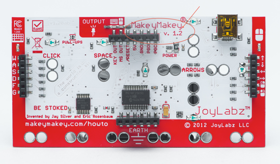

# [Makey Makey](http://www.makeymakey.com/)

Surgió de un proyecto de KickStarted

* ¿Cuanto cuesta? - 50€

* ¿Qué es? Sacar de [aquí](https://lilydev.wordpress.com/2013/04/16/the-awesomeness-of-makey-makey/)

Por delante

Por detrás

¿Qué necesitamos?

## [¿Cómo funciona?](http://makeymakey.com/howto.php)

[Ejemplo](https://lilydev.wordpress.com/2013/04/16/the-awesomeness-of-makey-makey/)

[Quiero más](https://learn.sparkfun.com/tutorials/makey-makey-advanced-guide)

# [Instalación](https://learn.sparkfun.com/tutorials/makey-makey-quickstart-guide)

1. En windows instala el [driver](https://cdn.sparkfun.com/tutorialimages/MaKey_MaKey_QuickStart/MaKeyMaKey-Driver-14-8-12.zip)
1. Comprueba que está instalado

1. Indica el path

1. Valida el driver

# Prueba

1. Prueba inicial

2. Prueba con cables

3. Añade componentes

# [Ejemplos](http://makeymakey.com/howto.php#software)

# Referencias

[Lecciones](http://makeymakey.com/lessons/)
