# Robótica en educación Primaria: Scratch, Echidna y Makey-makey

## CEP Priego-Montilla

## Octubre de 2019

### José Antonio Vacas @javacasm

## http://bit.ly/RPPriego

# Proyectos

# Pedagogía y técnicas de aula

* Normalmente trabajaremos en grupos de 3-4 alumnos por robot
    * Trabajo en equipo
    * Revisión del código por pares
        
* Podemos hacer que programen por separado y que envíen el programa (vía correo o pendrive o similar) para que se programe alguno de los robots disponibles
    * Fomentamos la paciencia y la cooperación
    * Revisión del código antes de enviarlo
    * Se discuten mejoras y variantes
    
## Estudio de conceptos VS Trabajo de proyectos

Aprender Conceptos -> Aplicarlos

### Fases de un Proyecto

Estudio -> Diseño -> Prototipo -> Producción

### Entregables:

Bocetos, prototipos, documentación, tests...

##Ejemplo: Vamos a definir un proyecto, sus fases, versiones,....
    
### Fases para construir  un robot

Son 4 las fases para construir un Robot

1. Mecánica: diseño de la estructura
  * Plantilla
  * Diseño
  * ¡¡ Improvisación !!
  * Materiales
  * Reciclado
2. Eléctrica: motores, alimentación,...
  * Pilas, baterías
  * Motores
3. Electrónica: necesitamos un control fino de los elementos
  * CPU (usamos un tipo especial llamado microncontroladores - Arduino)
  * Interruptores
  * Sensores
4. Informatica: crearemos un programa capaz de controlar los elementos y hacer cumplir al robot las funciones que necesitamos	    

## Organización del material

* Inventariar
* Utilizar cajas o similar
* Inculcar el concepto de "orden del taller" en los asistentes
* Responsabilizarlos

## Reconocedor de frutas

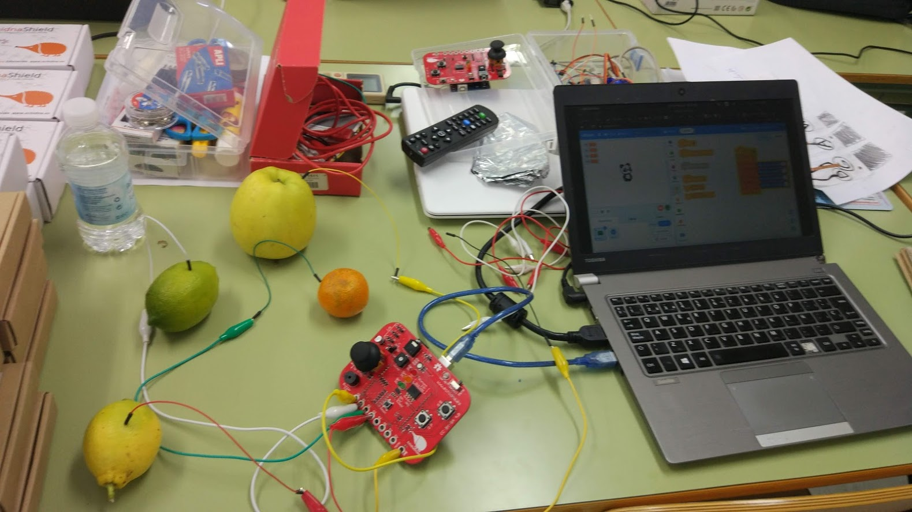

Medimos la conductividad de varias frutas y en función del valor medido reconocemos una u otra. Para ello ponemos la echidna en modo MKMK y vamos conectando los 2 cables (A0 y Tierra MKMK) a cada fruta.

Utilizamos la extensión Text to Speech para oir los resultados

Programa para Arduino

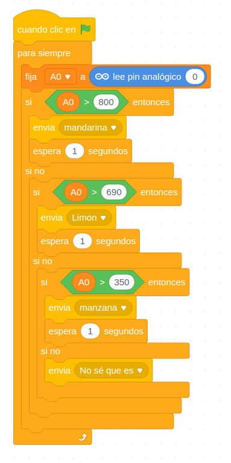
Programa para que Osito reconozca las frutas
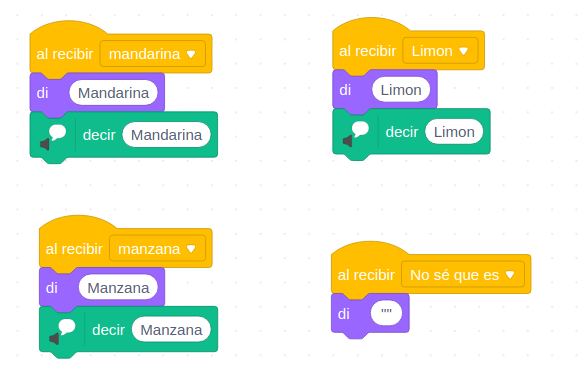

[Proyecto](https://planet.mblock.cc/project/projectshare/103635)

## Quiz

Usamos una make-makey para que el usuario encuentre las correspondencias. Un sencillo programa tiene las respuestas correctas. Cada una de las preguntas/respuestas están conectadas a makey-makey y el usuario conectado a tierra tiene que tocar las parejas

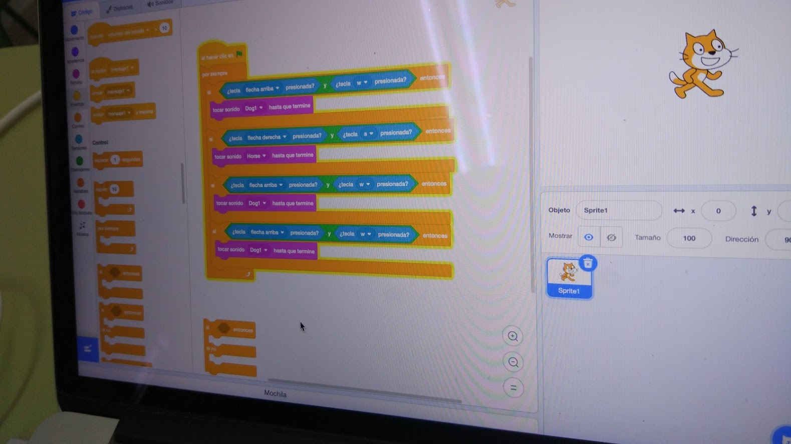
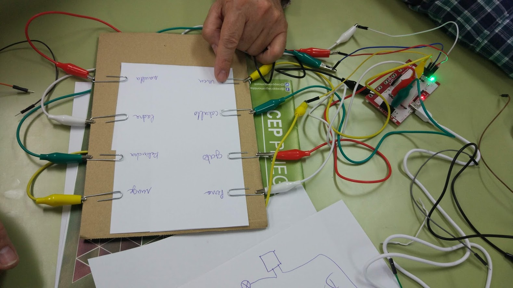

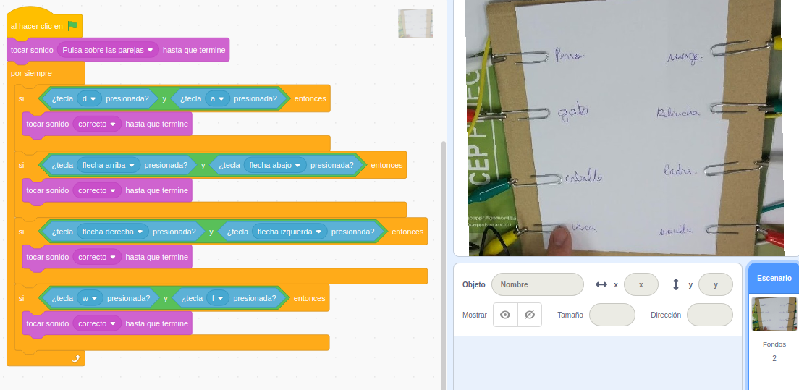

[Proyecto](https://scratch.mit.edu/projects/341130424/)
## Semáforo sonoro

Conectamos un sensor de sonido (un micrófoco premplificado) a la entrada IN de la echidna que utiliza el pin analógico A4. En función del valor leído encendemos los leds Verde, Amarillo o Rojo

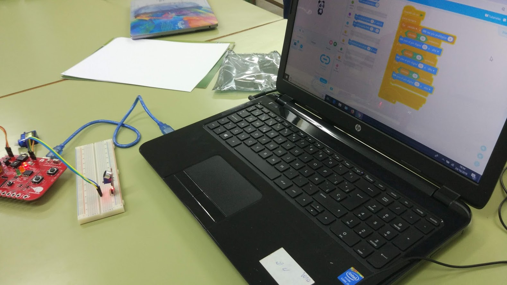
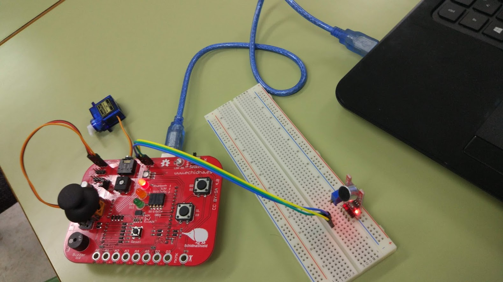

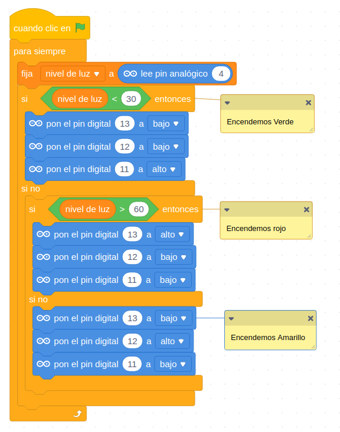

[Proyecto](https://planet.mblock.cc/project/projectshare/103651)

## Medida de humedad del suelo y sistema de riego

Vamos a medir la humedad del suelo para crear un sistema automático de riego
* Conectamos un sensor de humedad de suelo a la entrada IN de echidna (A4)
* Conectamos un servomotor para simular a la válvula/grifo que enciende el riego. Alternativamente podemos usarlo para mover un cartel/indicador que nos diga que la planta tiene sed

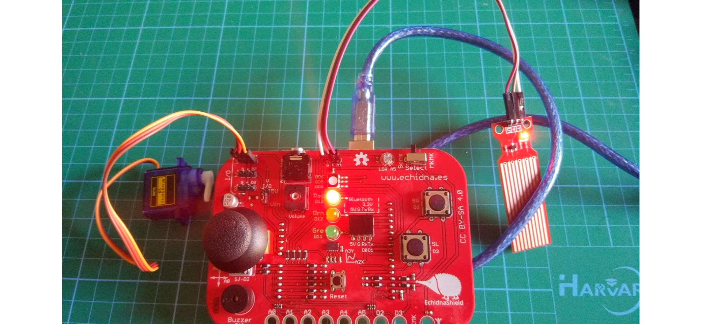

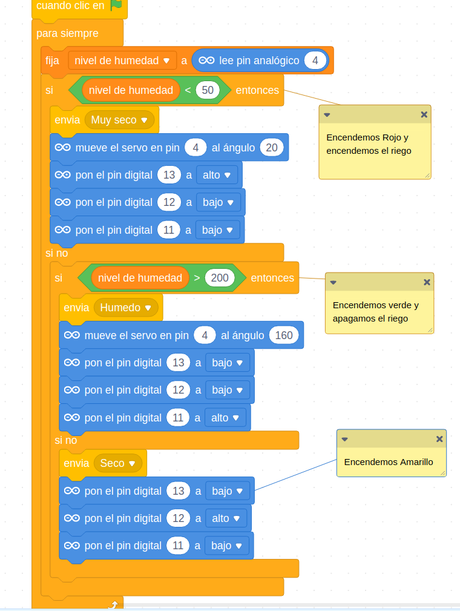

En función del nivel de humedad enviamos 3 mensajes distintos: Húmedo, Seco y Muy Seco

Se han creado varios fondos y varios personajes que cambian al recibir los mensajes

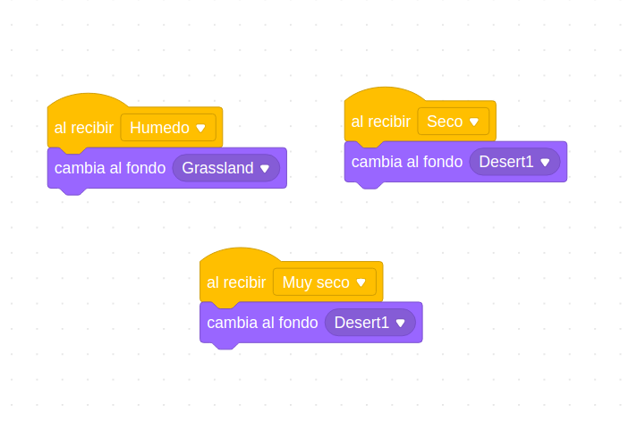
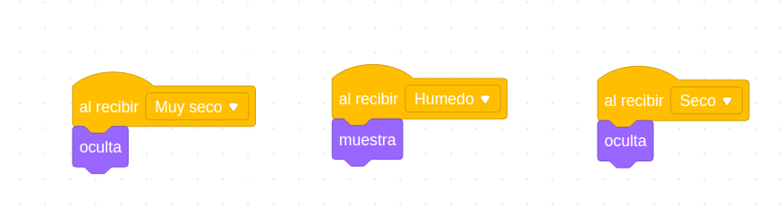

[Proyecto](https://planet.mblock.cc/project/103662)

## Trabajando con formas

Una Makey-Makey nos permite detectar cuál forma estamos tocando

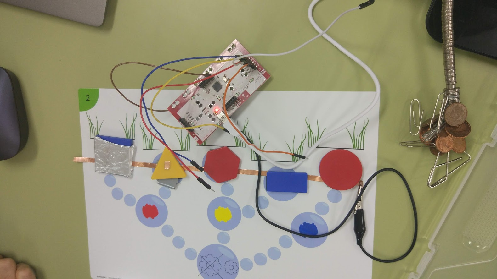

## Batería & Instrumentos

Usamos una placa Makey-makey para reproducir distintos sonidos

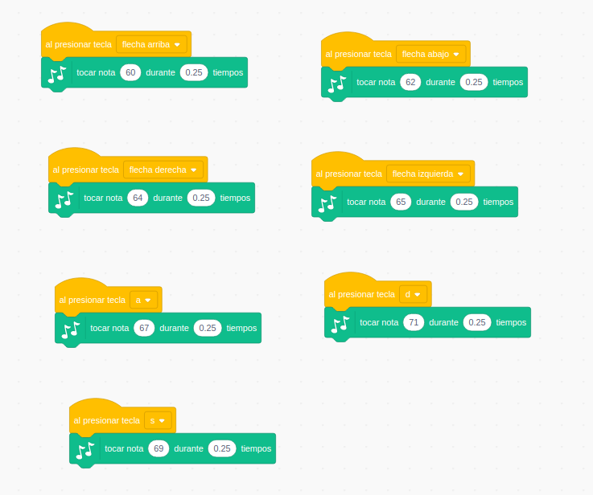
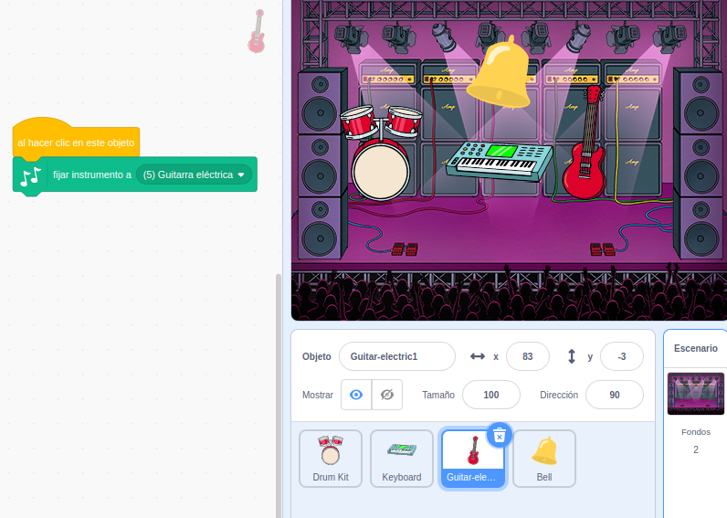

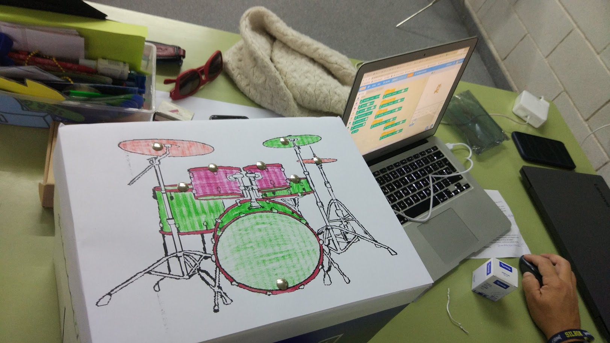

[Proyecto](https://scratch.mit.edu/projects/340880761/)

## Kahoot físico

Sistema para hacer votaciones similar a KaHoot

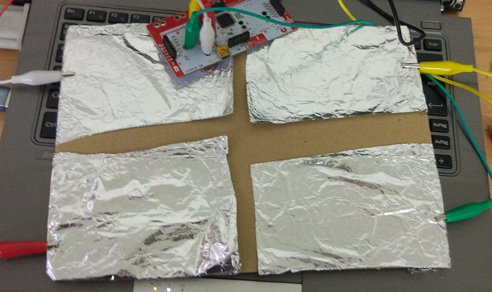

[Proyecto](https://scratch.mit.edu/projects/340884761/)
