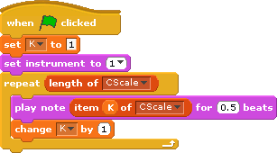
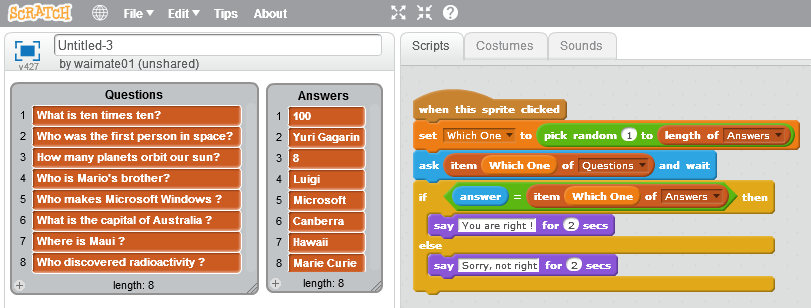

## Array/Lista en Scratch

Un Array/Lista no es más que una colección de variables que podemos usar juntas.

Se suelen utilizar para guardar grupos de valores.

Podemos acceder a sus valores como vemos en el siguiente programa

Un ejemplo típico es un programa de preguntas y respuestas

Podemos importar/exportar los valores de un Array/Lista desde la pantalla

Cuando guardamos un programa se guardan los valores de todos los arrays.
Podemos borrar todos los valores con el bloque "Borrar" seleccionando la opción "Todos"

