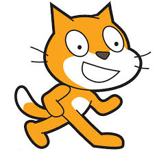
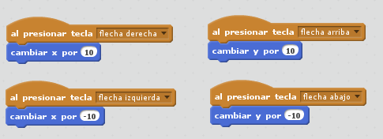

ScratchInteraccion.md

## Eventos
### Teclas
### Raton
### Otros

## Sentencias de Control

### Usanddo bucles repetitivos
### Ejercicio : estrella de 60 cuadrados de colores

#### Nos van a permitir establecer el orden de ejecución de los bloques:

* Podemos hacer bucles: contar y  mientras
* Condicionales: dependiendo de las operaciones lógicas

## Moviéndonos por la pantalla

## Personaje

### Cada personaje lleva su propio programa

## Las coordenadas son unas "variables especiales"

* Vamos a mover un personaje por la pantalla

* Usaremos las teclas (sensores y condicionales)

# Ejercicio: Vamos a mover un personaje con las teclas

### Un mismo personaje puede tener varios disfraces

### Ejercicio: crea una animación con varios disfraces

