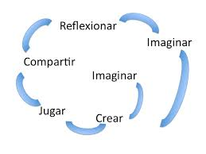

# Scratch, aprender programando [(191813GE031)](https://www.juntadeandalucia.es/educacion/secretariavirtual/consultaCEP/actividad/191813GE031/) 

## CEP Guadix

### José Antonio Vacas @javacasm

## https://github.com/javacasm/ScratchGuadix

* * * 

# Programación en la educación

## La moda de la robótica y la programación

* MOOCs Robóticos
* Experiencias online por todas partes

## ¿Proyectos de robótica y programación o mejor proyectos que usan la programación y la robótica?

* ¿Asignatura de robótica?

* ¿Enseñar a programar?

* ¿qué aporta?

### Mejor si lo usamos como algo transversal

### ¿Edades?

* ¿Uno para todos o uno para cada edad?

## ¿Coste?

* Podemos aprender a reciclar materiales

## ¿Qué es la robótica? ¿qué es programar?

* ¿Seré capaz de programar? Vamos a verlo...
	* ¿Podemos enseñar a programar?
	* ¿Para qué sirve programar?

* ¿Seré capaz de diseñar en 3D? Veámoslo
	* ¿Lo uso o lo hago?

* ¿Sabré electrónica? Kits

* ¿Sabré dirigirlos? ¡Seguro que sí!
	* Trabajando los proyectos

* ¿Necesito un taller?
	* Trabajando fuera del aula

Más dudas que otra cosa...

### ¿para qué sirve?

* Capacidad de razonamiento
* Enseña a resolver problemas
* Capacidad analítica
* Concentración

### ¿Qué aporta?

Són muchos los [estudios](http://programamos.es/evidencias-cientificas-de-los-beneficios-de-aprender-a-programar-desde-infantil/) que "demuestran" sus ventajas

### ¿Qué buscamos?

#### **Queremos mejorar la manera en la que se aprende**

# Objetivos

* Poder trabajar con **problemas abiertos**
* Aprender a **analizar** y **modelizar**
* **Pensamiento algorítmico**
* Conectar fácilmente con [**STEAM**](https://en.wikipedia.org/wiki/STEAM_fields) (STEM+Arte)
* **Compartir** las soluciones

## Virtudes

* **Intuitivo** (aprendemos por nosotros mismos investigando), potencia el aprendizaje
* **Facilidad de uso**
* Usamos bloques **muy visuales** (facilitando la memoria visual)
* Sólo encajan algunos bloques entre sí (concepto de sintaxis)
* Enseña a usar un **método estructurado** que facilita la traducción de los algoritmos
* No enseñan que **no siempre la solución es única**:
  * Mostrando que hay margen de mejora y **optimización**
  * Fomentando la **creatividad**
* Facilita el aprendizaje del **entorno tecnológico**

## [Un ejemplo: Granada Mágica](./AlhambraMagica.md)
